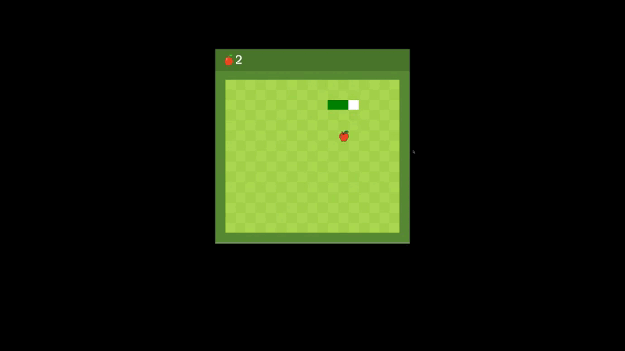

# 🙋 Welcome 

<b>I bring order to chaos, I turn coffee into code, I automate processes, I constantly develop</b> 
<b>As Grandpa Jops said: "Everyone in this world should learn to program, because programming teaches you to think"</b>
 

# 😁 About me
 
 <b>
    ✌️ Hello, my name is Ashot and I am 22 years old, I have been programming for 1 year, I am studying new technologies and moving along my path in IT  
    🎓I have freelancing experience, faced such tasks as: Landing pages, Chatbots for Discord / Telegram, Web applications, voice assistants, data parsing.
     At the moment I am studying at GeekBrains to better understand the concept of development and work in a team, as well as improve my knowledge and skills.  
    👩‍💻 At the moment I am working on an online store and a voice assistant.  
    🎸 I also play the guitar in my free time.   
 </b>

# 🐍 Python-Developer  

 

 
🟣 <b>Landing pages and web applications</b> 
🟣 <b>Chatbots for Discord / Telegram</b> 
🟣 <b>AI voice assistants</b>  
🟣 <b>Mass parsing of data from the network</b>  
🟣 <b>Work and optimization of data / structures</b> 
🟣 <b>Algorithmization and MySQL</b> 

 

# 🙂 GitHub Stats

# Illustration
<table>
   <tr> 
      <td> <b>snake-js</b> </td>
      <td> <b>landing-market</b> </td>
   </tr>
</table>